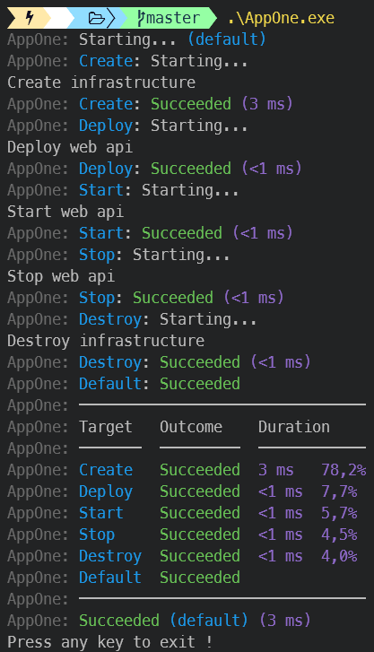

[](https://github.com/aimenux/BullseyeDemo/actions/workflows/ci.yml)
# BullseyeDemo
```
Using Bullseye to simulate api lifecycle management tasks
```

In this demo, i m using [Bullseye](https://github.com/adamralph/bullseye/) to simulate some fake management tasks.

> How to run ?
>
> :writing_hand: `Show help` : AppOne.exe -h
>
> :writing_hand: `Show targets` : AppOne.exe -l
>
> :writing_hand: `Run all targets` : AppOne.exe
>
> :writing_hand: `Run create target` : AppOne.exe Create
>
>
> 
>

**`Tools`** : vs22, net 6.0
